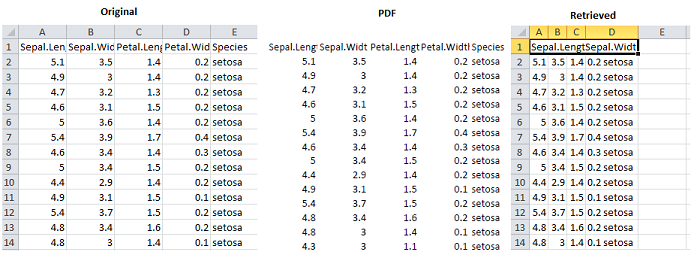

pdftables
=========

[](http://cran.r-project.org/web/packages/pdftables) [](https://travis-ci.org/expersso/pdftables) [](http://cran.r-project.org/web/packages/pdftables)

### Introduction

The `pdftables` package allows the user to convert PDF tables to formats more amenable to analysis (csv, XLM, or XLSX) by wrapping the [PDFTables API](https://pdftables.com)

The package can be installed from either CRAN or Github (development version):

``` r
# From CRAN
install.packages("pdftables")

# From Github
library(devtools)
install_github("expersso/pdftables")

library(pdftables)
```

To use the package the user first needs to sign up to the [PDFTables API](https://pdftables.com/join) to get an API token (they offer a free package that allows up to 50 pages).

### Usage Example

In the following example we first write the `iris` dataset to a `.csv` file. We then open that file and print it as a `.pdf` file (which spans three A4 pages). Using the `get_table` function we then upload that PDF to the [PDFTables API](https://pdftables.com) which parses and returns the extracted data as a `raw` vector. Finally, we write the result to a new `.xlsx` file which we can open in Excel.

(Note: All functions in the package require that you provide your api key in the `api_key` argument. By default this looks for an environment variable called `pdftable_api`, but you can also provide it directly.)

``` r
write.csv(iris, file = "test.csv", row.names = FALSE)

# Open test.csv and print as PDF

test_xlsx <- get_table(file = "test.pdf", format = "xlsx-multiple")

f <- file("test.xlsx", "wb")
writeBin(test_xlsx, f)
close(f)
```



The next example follows the same logic, only this time we specify the format to be `csv`, which returns a comma-separated string. We then write this to a `.csv` file.

``` r
test_csv <- get_table(file = "test.pdf", format = "csv")

f <- file("test_retrieved.csv", "w")
write(test_csv, f)
close.connection(f)
```

Note that the conversion is rarely recovers the underlying data exactly, so you may have to open the retrieved file and make some manual corrections.

The `get_remaining` function shows you how many pages you have remaining.

``` r
get_remaining()
```
